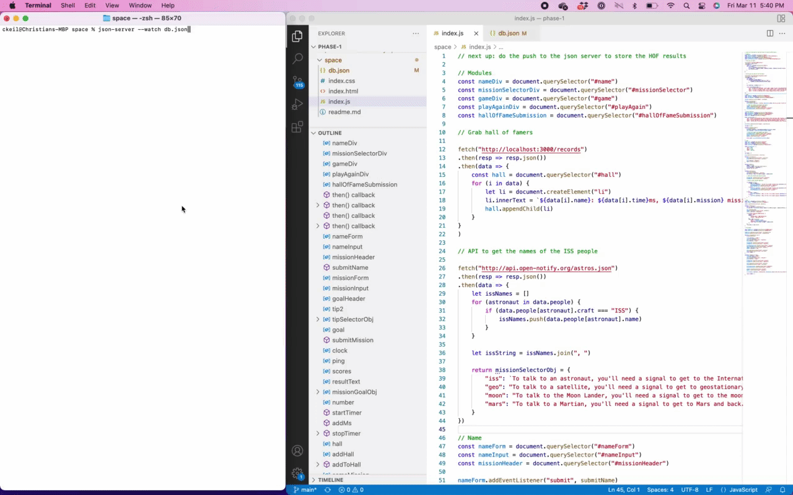

# INTRO
Hey, welcome to my SPACE COMMUNICATIONS game!

My original idea was to try to teach people how far away things are in space. I work at a space company, and I've learned that people have basically no intuition for how big space is.

For instance: the International Space Station seems pretty far away, right? I mean, it's in space. But it's only 248 miles above Earth! That's a four-hour drive by car; I'm in San Francisco, so I'm closer to the International Space Station when it flies overhead than I am to Los Angeles.

But then other objects, like Mars, seem not that far away. It's in our solar system, right. How many times larger is the distance to Mars than the distance to the Moon? The answer: it's about 142x further!

I wanted to build an easy-to-use game that helps people get an intuitive sense for how far these things are away. And I decided that the best way was to imagine a SPACE WALKIE TALKIE and how long it would take to communicate to someone on those planets.

#  VIDEO WALKTHROUGH

# STRUCTURE OF THE APP
The basic structure reveals itself as you move through the app: there are four modules that hide/reveal themselves as you enter data.

## NAME INPUT
Just gets the person's name to personalize the rest of the copy. Submit the form, move on.

## MISSION SELECTION
This is a simple drop-down menu in which you select the space object you want to attempt to communicate with: an astronaut (the ISS), a satellite (geostationary orbit), the lunar lander (the Moon), or a Martian (Mars).

Once you make that selection, the app sets the "goal" value, which is basically how much time you have to let pass on the timer before you stop it. It also populates some custom text to explain the mission, and to give you a customized pro tip that tells you how far away the signal will have to go in miles and km.

(This is also where I met the requirement of the game to use an external API. The app inserts a list of the current astronauts on board the International Space Station into the mission overview of the "talk to an astronaut" mission.)

## THE GAME
This is a timer that ticks up once every millisecond. Click once to start, once to stop the timer. The goal of the game is to stop the timer at precisely the right millisecond that it would take a walkie-talkie signal to shoot up to your target of interest and then bounce back to Earth. (This can be found by dividing the distance to and from the target by the speed of light.)

I had to add logic that prevented someone from trial-and-error-ing their way to the precise value (aka that only lets you start/stop once per attempt). I also have a dynamic result that says the player wins if they stop the clock within 25 milliseconds of the goal time set during mission selection, and that they fail  if they don't.

## HALL OF FAME // PLAY AGAIN
If the player wins, I offer them the chance to enter their name and score into the Hall of Fame, a JSON database that persists beyond an individual game session. If they click yes, they're in!

And in any case, I give the player a chance to play again, either by clicking the "same mission" button to try again at the same task, or the "different mission" button to swap out for a new challenge.

# USING THE APP
Hopefully it's pretty self-explanatory. If anything, I probably wrote too much copy.

# FUTURE ADDITIONS
I have plenty of ideas:
- it would be cool to dynamically visualize the signal going to and from the target; could I have a line that auto-draws when the user clicks "submit" that goes to the object in space and back?
- maybe a "hard mode" toggle could hide the timer once you click "submit" and only show it again after you click "receive"
- honestly just any semblance of CSS would make the game way prettier
- the database obviously just lives on my local server right now, so making it into an actual webapp that can live on the internets would be fun. I want other people than me to play it!

